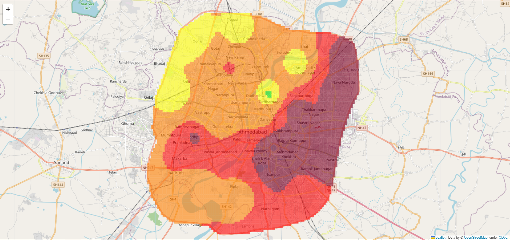

# Ahmedabad Heatmap
 ## Creating Rectangles within a Boundary GeoJSON

This Python script demonstrates how to generate a collection of rectangular polygons within a given boundary defined by a GeoJSON file. The script uses the `shapely` library to check for intersections between the rectangles and the boundary polygon.

## algorithm
### IDW Interpolation

The code provided demonstrates an implementation of Inverse Distance Weighting (IDW) interpolation using the `idw_interpolation` function. IDW interpolation is a spatial interpolation technique that estimates values at target points based on known values at surrounding points.

The `idw_interpolation` function takes in three parameters: `points`, `values`, and `target_points`. The `points` parameter is an array of known points with their coordinates, the `values` parameter is an array of known values corresponding to the points, and the `target_points` parameter is an array of points where the interpolated values are to be estimated. The function also takes an optional `power` parameter to control the influence of nearby points on the interpolation.

### PM2.5 Value Estimation

The code snippet provided includes the `estimate_new_pm25` function, which is used to estimate new PM2.5 values based on previous values and wind parameters.

### Data Loading and Processing

The provided code snippet demonstrates the process of loading and processing data from JSON files for further analysis and calculations.

After loading the data, the code performs IDW interpolation for each target ID separately. It utilizes the `idw_interpolation` function, passing the known points, known values, and target points as inputs. 

### PM2.5 Value Calculation

The code snippet calculates the new PM2.5 values based on the previously interpolated values and other parameters.

### AQI Colored GeoJSON Creation

The code snippet includes the `create_aqi_colored_geojson` function, which generat sarts a GeoJSON file to an HTML file for visualization using Folium.

## sample
A sample of image for heatmap of Ahmedabad(dummy data as of now)

